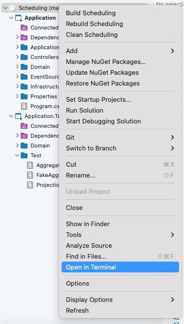

# Training Introduction to Event Sourcing, CQRS and DDD Modelling in .NET

# Instructions for setting up project

**You'll need to have [.NET 6](https://dotnet.microsoft.com/download/dotnet/6.0) and [docker](https://www.docker.com/products/docker-desktop) installed to be able to run the project and tests.**

1. Clone this repository
2. Make sure you are on master branch.
3. To start EventStoreDB using Docker, run:
   - `docker-compose up` - for X86-based computers,
   - `docker-compose -f docker-compose.arm64.yml up` - for ARM-based computers like MacBook M1.

      To access the github packages docker images, you need to authenticate docker with a gitub personal access token. It should be [generated](https://github.com/settings/tokens/new). Select at least following scopes: `repo`, `read:packages`. Then login to github docker registry with:
      ```shell script
      docker login https://ghcr.io -u  -u YOUR_GITHUB_USERNAME -p YOUR_PERSONAL_ACCESS_TOKEN
      ```
      Check full instructions in the ["Authenticating to the Container registry"](https://docs.github.com/en/packages/working-with-a-github-packages-registry/working-with-the-container-registry#about-container-registry-support) guide.
4. Open solution in IDE and run all tests using
   - `dotnet test` command,
   - or run through your IDE test runner.

### Visual Studio for Mac (Preview) v17

- Right Click on the `Scheduling` in Solution Explorer

    

- Open Terminal
- Type `dotnet test`
- You should see `Passed!  - Failed:     0, Passed:    17, Skipped:     0, Total:    17`

    


Any problems please contact training@eventstore.com
